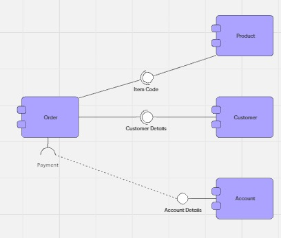

# Avance de clase - Andrés

**Componentes planeados**
Para una representación de los componentes a gran escala se plantaron los siguientes elementos
- Controllers Layer
- Services Layer
- Repositories Layer
- Security Middleware
- Third-Party Connectors Layer

**Prototipo Propuesto**
Se encontraron diferentes ejemplos pero se sugiere el siguiente para la adaptación del siguiente ejemlpo encontrado en: https://miro.com/blog/mapping-architecture-diagrams/

