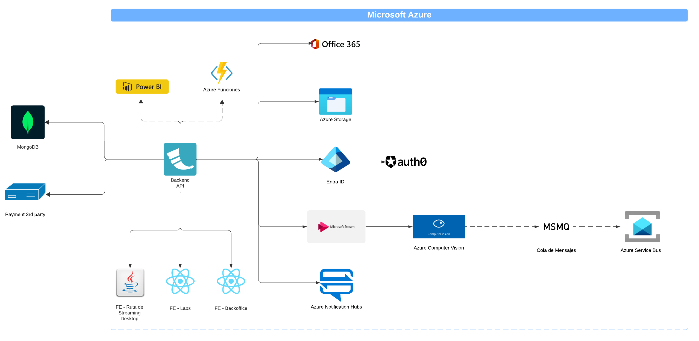
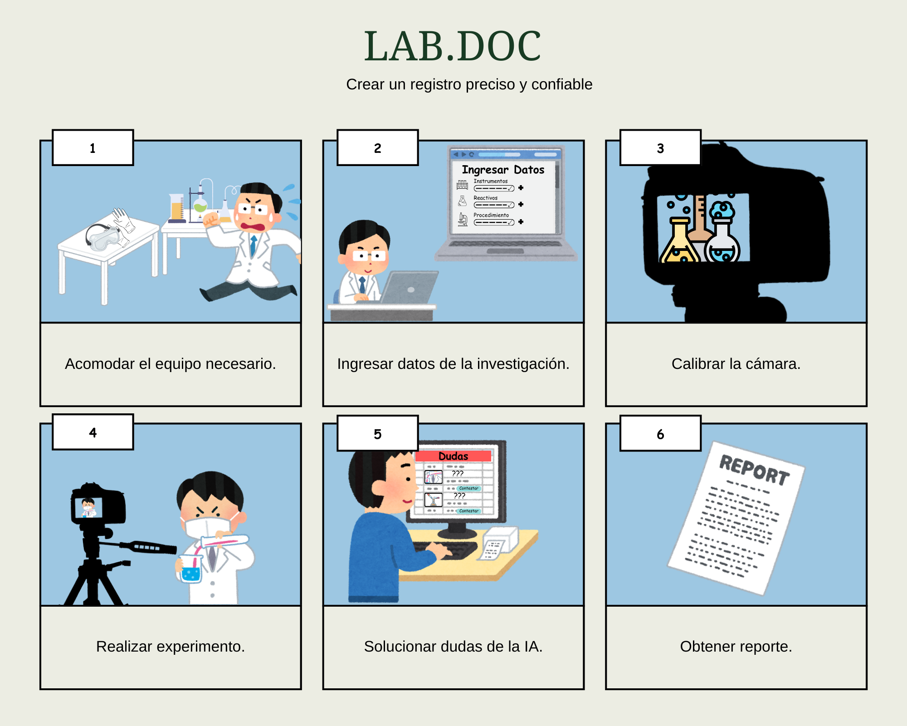

# Lab.Doc

Se pretende realizar un sistema de software que facilite la tarea de la documentación de procesos de laboratorio, brindado la posibilidad de seleccionar distintos procesos estandarizados y que generen una descripción detalla del proceso automáticamente, además de poder añadir los diferentes materiales utilizados durante el proceso y la posibilidad de añadir más procedimientos con sus propios materiales a las practicas de laboratorio a documentar. Con esta información introducida por el usuario, se generará un archivo en el formato de preferencia, agilizando los procesos de descripción y escritura de los procedimientos realizados. 

A su vez, se pretende incluir un sistema de monitoreo de practica para los dispositivos con cámara que utilicen la aplicación, donde el sistema se capaz de reconocer el tipo de practica y procedimiento a realizar y identifique malas practicas de laboratorio, como pruebas con tiempos desmedidos o contaminación de material en la prueba. Al captar estos errores, ser capaz de enviar una alerta a el practicante para que verifique la advertencia y evitar fallos en los procedimientos que puedan llevar a resultados alterados.

**Requerimientos:**

    Prioridad 1:

    - Registro de laboratorio.
    - Asociar usuarios.
    - Registro de procedimiento.
    - CRUD inventario.
    - Procesos de pago.
    - Administrar subscripciones.
    - Bitácora de procedimiento.
    - Edición de bitácora.
    - Mantenimiento de subscripciones y usuarios.
    - Mantenimiento de laboratorio.
    - Registro de pagos.

    Prioridad 2:

    - Registro de resultados.
    - Autenticación y autorización de usuarios. 
    - Histograma de actividad.
    - Visualizar estadísticas.
    - Entreno de IA.
    - Resolución de dudas.
    - Calibración del procedimiento.
    - Especificación de datos del procedimiento.

    Prioridad 3:

    - Formato de exportación.
    - Análisis de resultados.
    - Alertas de monitoreo.
    - Dashboard estadístico.

## Diagrama de Arquitectura

## Problem Statement y Storyboard

Crear un registro preciso y confiable.

## Requerimientos No Funcionales

**Performance**
What are the expected response times for different functions under normal and peak load conditions?
- Funciones de Registro de Bitacotras: nomral 200ms hasta 500ms, critico 700ms hasta 1,5s
- Funciones de Monitoreo: nomral 500ms hasta 1,5s, critico 1,5s hasta 2,5s
- Funciones de Generación de PDF: nomral 1s hasta 3s, critico 4s hasta 8s

How many concurrent users should the system support?
- 15 a 30 usuarios simultáneos en un escenario normal de trabajo en el sistema, aunque es posible que en el peor de los casos se pueda dar un caso de 40 a 50 usuarios simultáneos

What are the performance benchmarks for critical operations?
- Para funciones criticas como el monitoreo con IA debe detectar errores en un rango de 1,5ms a 2,5.
- Para las funciones de escritura y lectura de la base de MongoDB se espera la escritura de 500 registros por segundo y la lectura de 1000 registros por segundo.
- La generación de pdfs se espera un rendimiento de un archivo cada 1,5 segundos hasta 2,5 o 3 segundos.

**Scalability**
How should the system handle increased load or data volume over time?
- Se deben aplicar estategias de escalamiento horizontal para lograr adaptarse al crecimiento del sistema, ya sea con la base de datos aplicando sharding con MongoDB o aplicarlas para componentes como Azure Service Bus y Azure Computer Vision para que manejen un mayor volumen de aviso de eventos y procesamiento de imágenes respectivamente.

Are there any specific scalability requirements for different components of the system?
- Principalemtente solo para la base de MongoDB, que se espera que se escale el compoenente cuando se supere una cantidad de almacenamiento establecido como 1TB por medio de shardign.

**Reliability**
What is the acceptable downtime for the system?
- se espera un tiempo máximo de 6 hora por mes de inactividad.

How should the system handle failures and ensure data integrity?
-El manejo de fallos y garantía de datos se puede lograr utilizando replicación de datos con MongoDB con funcionalidades de failover automático en componentes importantes, además de implementar patrones de reintentos automáticos ante fallos, sin mencionar las transacciones ACID de las bases de MongoDB que evita la corrupción de los datos ante fallos.

What are the backup and recovery procedures?
- Se espera implementar un respaldo automático de datos en MongoDB Atlas que se encuentren configurados con una retención de 30 días y una recuperación de datos cada 15 minutos, todo esto complementado con pruebas de respaldo periódicas que aseguren el funcionamiento de tales procesos.

**Availability**
What are the uptime requirements for the system?
se espera un SLA del 95% de los componentes principales, como lo son MongoDB, Azure Functions y Azure Service Bus, que son indispensables para el funcionamiento del sistema.

Are there specific times when the system must be available without fail?
- Se exige que el sistema se encuentre sin interrupciones o fallas inesperadas en horarios laborales convencionales según la zona horaria en donde se este utilizando el sistema, pero de forma general, se espera que de lunes a viernes durante las 7:00am a las 7:00pm y los sábados de 8:00am a 5:00pm se encuentre sin ninguna falla. Para mantener esto, se pretende establecer un periodo de mantenimiento programado según la zona horaria para el sistema y así evitar fallas en el sistema o detectarlas con anticipación.

**Compliance**

What legal and regulatory requirements must the system comply with?

- Debe cumplir con las normativas de protección de datos personales ya que contiene información como el correo electrónico y métodos de pago (en caso de que se realice la función). También debe seguir las regulaciones específicas del sector de laboratorios e investigar que tanto varían entre cada país en el que va a estar disponible la aplicación.

Are there industry-specific standards that need to be followed?

- El sistema debe seguir estándares de calidad y seguridad específicos de la industria de laboratorios. Además se debe tomar en cuenta las buenas prácticas de laboratorio.

**Extensibility**

How should the system be designed to accommodate future enhancements?

- Se va a utilizar el modelo MVC y el principio de atomic design. El atomic design permite agregar funcionalidades nuevas que se adaptan a el producto grande ya existente, mientras que MVC permite manejar por separado la interfaz, los servicios y los datos, facilitando modificaciones en cada capa.

Are there specific areas where extensibility is critical?

- En el área de monitoreo se debe poder integrar con nuevos dispositivos de laboratorio y agregar nuevos procedimientos y materiales.

**Localization**

What are the requirements for supporting multiple languages and regions?

- El sistema debe poder soportar varios idiomas por medio de internacionalización y localización. Se deberá traducir la interfaz de usuario, mensajes de error, alertas, documentación, etc. Además, debe poder manejar diferentes horarios y monedas.

How should the system handle different date, time, and currency formats?

- El sistema deberá utilizar bibliotecas de internacionalización que permitan configurar formatos de fecha, hora y moneda según la región del usuario. Deberá convertir y mostrar datos en el formato adecuado según la región del usuario.

**Documentation**

What documentation is required for users, administrators, and developers?

- Usuarios: Manual de usuario detallado que explique cómo utilizar el sistema.
- Administradores: Documentación sobre la configuración y mantenimiento del sistema.
- Desarrolladores: Documentación sobre la arquitectura del sistema, APIs y otra información para el desarrollo.

How should the documentation be maintained and updated?

- La documentación se mantendrá en GitHub y se actualizará regularmente. Cada modificación se documentará, cuando sea necesario, y se subirá al repositorio que estará disponible para usuarios y desarrolladores.
