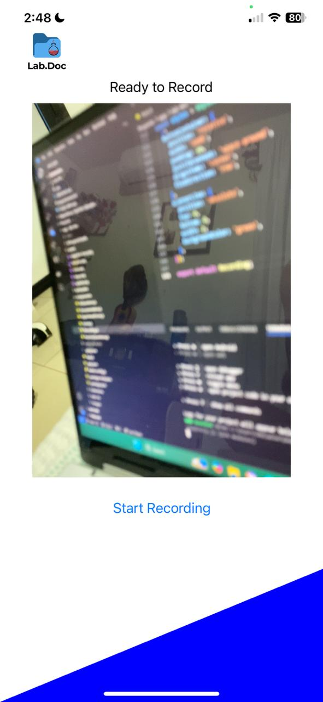
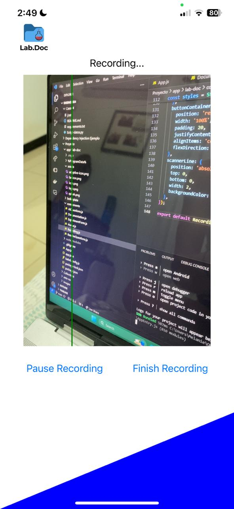
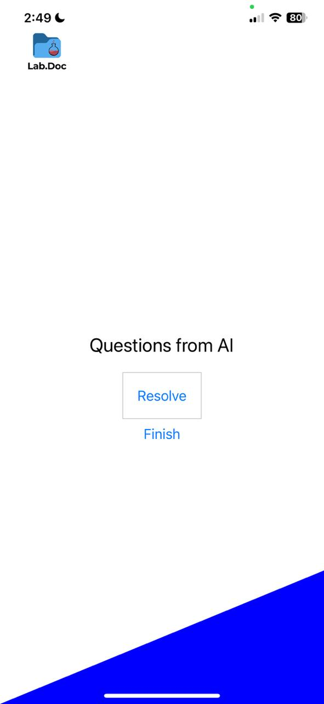
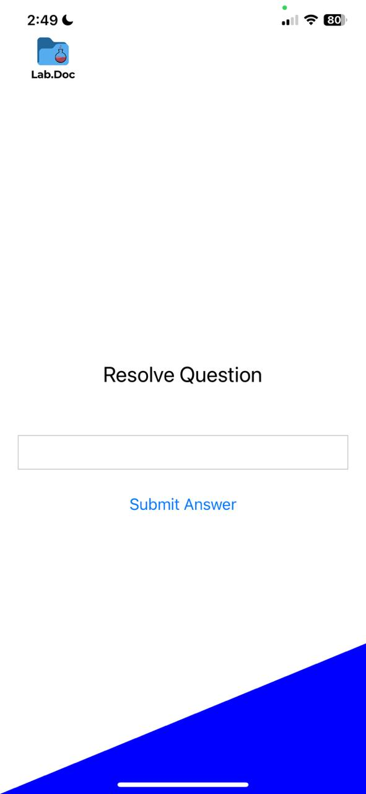
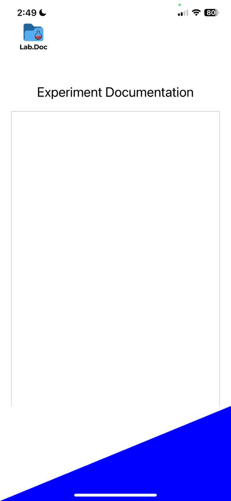
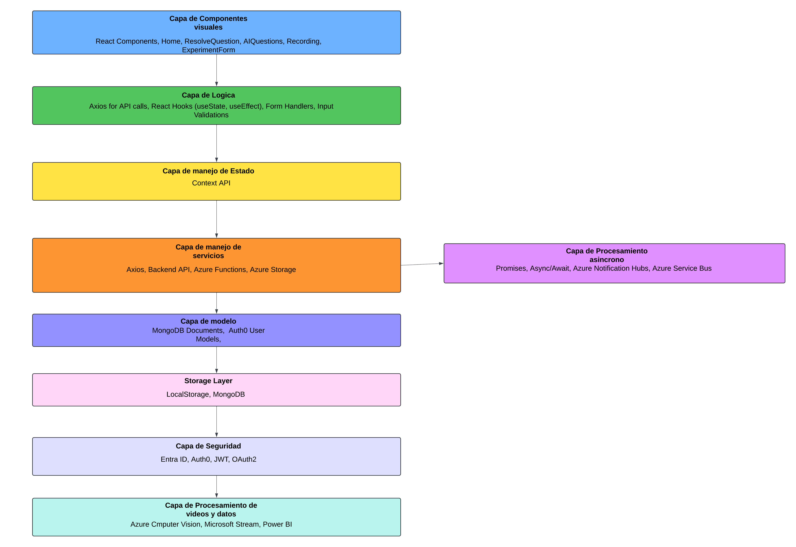
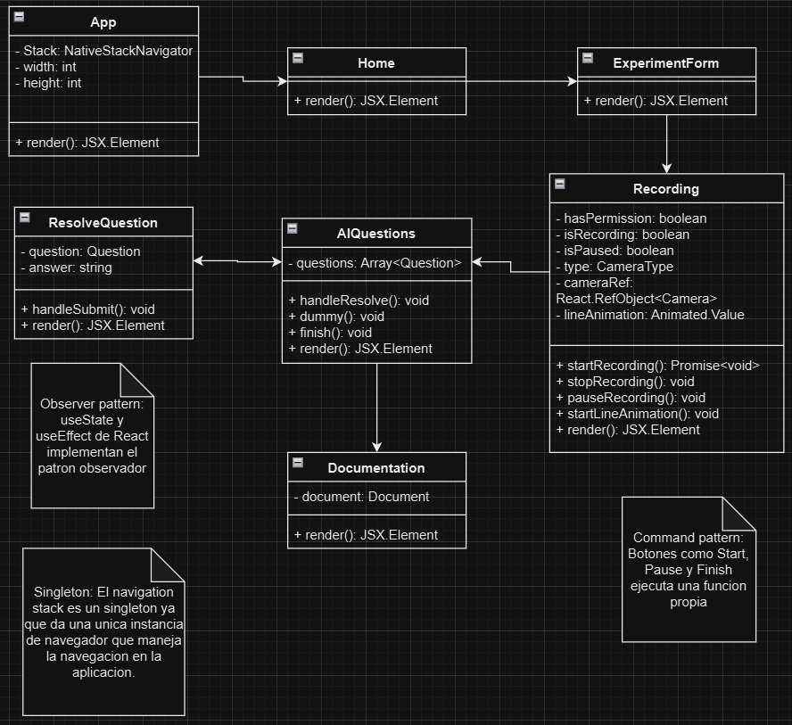

# Lab.Doc

Se pretende realizar un sistema de software que facilite la tarea de la documentación de procesos de laboratorio, brindado la posibilidad de seleccionar distintos procesos estandarizados y que generen una descripción detalla del proceso automáticamente, además de poder añadir los diferentes materiales utilizados durante el proceso y la posibilidad de añadir más procedimientos con sus propios materiales a las practicas de laboratorio a documentar. Con esta información introducida por el usuario, se generará un archivo en el formato de preferencia, agilizando los procesos de descripción y escritura de los procedimientos realizados. 

A su vez, se pretende incluir un sistema de monitoreo de practica para los dispositivos con cámara que utilicen la aplicación, donde el sistema se capaz de reconocer el tipo de practica y procedimiento a realizar y identifique malas practicas de laboratorio, como pruebas con tiempos desmedidos o contaminación de material en la prueba. Al captar estos errores, ser capaz de enviar una alerta a el practicante para que verifique la advertencia y evitar fallos en los procedimientos que puedan llevar a resultados alterados.

**Requerimientos:**

    Prioridad 1:

    - Registro de laboratorio.
    - Asociar usuarios.
    - Registro de procedimiento.
    - CRUD inventario.
    - Procesos de pago.
    - Administrar subscripciones.
    - Bitácora de procedimiento.
    - Edición de bitácora.
    - Mantenimiento de subscripciones y usuarios.
    - Mantenimiento de laboratorio.
    - Registro de pagos.

    Prioridad 2:

    - Registro de resultados.
    - Autenticación y autorización de usuarios. 
    - Histograma de actividad.
    - Visualizar estadísticas.
    - Entreno de IA.
    - Resolución de dudas.
    - Calibración del procedimiento.
    - Especificación de datos del procedimiento.

    Prioridad 3:

    - Formato de exportación.
    - Análisis de resultados.
    - Alertas de monitoreo.
    - Dashboard estadístico.

## Diagrama de Arquitectura

## Problem Statement y Storyboard

Crear un registro preciso y confiable.

## Requerimientos No Funcionales

**Performance**

What are the expected response times for different functions under normal and peak load conditions?
- Funciones de Registro de Bitacotras: nomral 200ms hasta 500ms, critico 700ms hasta 1,5s
- Funciones de Monitoreo: nomral 500ms hasta 1,5s, critico 1,5s hasta 2,5s
- Funciones de Generación de PDF: nomral 1s hasta 3s, critico 4s hasta 8s

How many concurrent users should the system support?
- 15 a 30 usuarios simultáneos en un escenario normal de trabajo en el sistema, aunque es posible que en el peor de los casos se pueda dar un caso de 40 a 50 usuarios simultáneos

What are the performance benchmarks for critical operations?
- Para funciones criticas como el monitoreo con IA debe detectar errores en un rango de 1,5ms a 2,5.
- Para las funciones de escritura y lectura de la base de MongoDB se espera la escritura de 500 registros por segundo y la lectura de 1000 registros por segundo.
- La generación de pdfs se espera un rendimiento de un archivo cada 1,5 segundos hasta 2,5 o 3 segundos.

**Scalability**

How should the system handle increased load or data volume over time?
- Se deben aplicar estategias de escalamiento horizontal para lograr adaptarse al crecimiento del sistema, ya sea con la base de datos aplicando sharding con MongoDB o aplicarlas para componentes como Azure Service Bus y Azure Computer Vision para que manejen un mayor volumen de aviso de eventos y procesamiento de imágenes respectivamente.

Are there any specific scalability requirements for different components of the system?
- Principalemtente solo para la base de MongoDB, que se espera que se escale el compoenente cuando se supere una cantidad de almacenamiento establecido como 1TB por medio de shardign.

**Reliability**

What is the acceptable downtime for the system?
- se espera un tiempo máximo de 6 hora por mes de inactividad.

How should the system handle failures and ensure data integrity?
- El manejo de fallos y garantía de datos se puede lograr utilizando replicación de datos con MongoDB con funcionalidades de failover automático en componentes importantes, además de implementar patrones de reintentos automáticos ante fallos, sin mencionar las transacciones ACID de las bases de MongoDB que evita la corrupción de los datos ante fallos.

What are the backup and recovery procedures?
- Se espera implementar un respaldo automático de datos en MongoDB Atlas que se encuentren configurados con una retención de 30 días y una recuperación de datos cada 15 minutos, todo esto complementado con pruebas de respaldo periódicas que aseguren el funcionamiento de tales procesos.

**Availability**

What are the uptime requirements for the system?
- Se espera un SLA del 95% de los componentes principales, como lo son MongoDB, Azure Functions y Azure Service Bus, que son indispensables para el funcionamiento del sistema.

Are there specific times when the system must be available without fail?
- Se exige que el sistema se encuentre sin interrupciones o fallas inesperadas en horarios laborales convencionales según la zona horaria en donde se este utilizando el sistema, pero de forma general, se espera que de lunes a viernes durante las 7:00am a las 7:00pm y los sábados de 8:00am a 5:00pm se encuentre sin ninguna falla. Para mantener esto, se pretende establecer un periodo de mantenimiento programado según la zona horaria para el sistema y así evitar fallas en el sistema o detectarlas con anticipación.

**Security**

What are the security requirements for data storage and transmission?
- Se encriptaran los datos en MongoDB, Azure Storage y sistemas de pago(AES-256 para rest y TLS 1.2+ para la transmision de los datos)
- Se usara endpoints privados en Azure y la Virtual Network Service Endpoints.
- Se habilitaran audit logs para operaciones sensibles en la base de datos y las partes relacionadas a la transmision de datos. 

How should user authentication and authorization be managed?
- Auth0 y Entra ID manejaran la autenticación con OAuth 2.0 para autorizacion and manejo de identidades.
- Se implementara RBAC (Role-based access control) usando Azure Entra ID para asegurarnos que solo ciertos usuarios puedan acceder a funciones especificas.

Are there any compliance requirements related to data security?
- Cumplimiento de normativas como el GDPR para proteger la información personal, como: correos electrónicos, métodos de pago, etc.
- Para manejar información de pagos, nos aseguraremos de que el sistema cumpla con los estándares PCI DSS para proteger los datos de las transacciones.
- Se seguiran las regulaciones específicas de la industria y las buenas prácticas de laboratorio, dictaminadas por cada pais.

**Usability**

What are the usability standards for the user interface?
- Que sea consistente en todas las interfaces del frontend, con disposicion familiar e intuitiva y que al mismo tiempo
mantenga un diseño responsivo.

How should the system accommodate users with disabilities?
- Cumplir con las pautas WCAG especificamente la version 2.1, permitiendo opciones de contraste de color, navegacion por teclado y soporte para lectores de pantalla.
- Permitir que el usuario pueda realizar cambios al tamaño de la letra para mejor visibilidad.

Are there specific requirements for user training and documentation?
- Se proporcionaran tutoriales por medio de videos y guias interactivas, integradas dentro del sistema.
- Para los usuarios, se proporcionara un manual de usuario detallado que explique cómo navegar y utilizar el sistema. 
- Para los administradores, se proporcionaran guias de configuracion y mantenimiento del sistema.
- Para los desarrolladores, se proporcionara documentacion tecnica sobre las APIS, arquitectura del sistema y configuracion, todo esto mantiendo en GitHubg para el control de versiones.

**Maintainability**

How easy should it be to update and modify the system?
- El sistema sera diseñado de manera modular utilizando el patrón MVC (Modelo-Vista-Controlador) y Diseño Atómico, asi se facilitara agregar o modificar componentes sin afectar todo el sistema.
- Cada servicio, como los basados en Azure Functions, MongoDB, y Azure Service Bus, estara desacoplado, asi se posibilita las actualizaciones independientes y menores riesgos durante los cambios.
- Se usaran pipelines de CI/CD en plataformas como Azure DevOps para simplificar las actualizaciones del sistema y minimizar el tiempo de inactividad.

What are the requirements for logging and monitoring system performance?
- Se implementara Azure Monitor para rastrear el rendimiento de los servicios (uso de CPU, memoria, etc.) y detectar anomalías en tiempo real.
- Se registraran todas las operaciones críticas y eventos en MongoDB y otras funciones clave con logs centralizados. También se incluiran logs detallados para Azure Notification y las API del backend.

How should the system handle version control and deployment?
- Se usara Git para el control de versiones en el código fuente, almacenado en GitHub.
- Se integraran pipelines de CI/CD para realizar despliegues automáticos al entorno de Azure App Service.
- Se mantendran entornos de pruebas bien definidos (staging),  antes de hacer el despliegue a producción.

**Interoperability**

How should the system integrate with existing software and hardware?
- El sistema expondra APIs REST a través del Backend API para facilitar la integración con otros sistemas existentes. Ademas las interfaces con sistemas como Office 365, Azure Storage, y servicios de terceros como plataformas de pago deben realizarse a través de APIs documentadas.
- En el caso de la gestión de usuarios y autenticación, el sistema debe integrarse con Entra ID y Auth0, lo que permite autenticar usuarios con identidades de otros sistemas.
- Las camras de los laboratorios se integraraa a través de la plataforma de monitoreo mediante la API de monitoreo y procesamiento de imágenes en conjunto con el servicio de Azure Computer Vision.

Are there any standards or protocols that the system must adhere to?
- Todas las comunicaciones entre el sistema y otros servicios deben realizarse mediante HTTP/HTTPS.
- La autenticación y autorización del sistema debe adherirse a los estándares de OAuth 2.0 y OpenID Connect, utilizando Auth0 y Entra ID para gestionar permisos y accesos.
- El sistema debe cumplir con los estándares de protección de datos como el GDPR (Reglamento General de Protección de Datos).
- Para la interoperabilidad y el intercambio de datos, se deben utilizar formatos estándar como JSON y, cuando sea necesario, XML, que aseguren la compatibilidad con otros sistemas o servicios.

**Compliance**

What legal and regulatory requirements must the system comply with?

- Debe cumplir con las normativas de protección de datos personales ya que contiene información como el correo electrónico y métodos de pago (en caso de que se realice la función). También debe seguir las regulaciones específicas del sector de laboratorios e investigar que tanto varían entre cada país en el que va a estar disponible la aplicación.

Are there industry-specific standards that need to be followed?

- El sistema debe seguir estándares de calidad y seguridad específicos de la industria de laboratorios. Además se debe tomar en cuenta las buenas prácticas de laboratorio.

**Extensibility**

How should the system be designed to accommodate future enhancements?

- Se va a utilizar el modelo MVC y el principio de atomic design. El atomic design permite agregar funcionalidades nuevas que se adaptan a el producto grande ya existente, mientras que MVC permite manejar por separado la interfaz, los servicios y los datos, facilitando modificaciones en cada capa.

Are there specific areas where extensibility is critical?

- En el área de monitoreo se debe poder integrar con nuevos dispositivos de laboratorio y agregar nuevos procedimientos y materiales.

**Localization**

What are the requirements for supporting multiple languages and regions?

- El sistema debe poder soportar varios idiomas por medio de internacionalización y localización. Se deberá traducir la interfaz de usuario, mensajes de error, alertas, documentación, etc. Además, debe poder manejar diferentes horarios y monedas.

How should the system handle different date, time, and currency formats?

- El sistema deberá utilizar bibliotecas de internacionalización que permitan configurar formatos de fecha, hora y moneda según la región del usuario. Deberá convertir y mostrar datos en el formato adecuado según la región del usuario.

**Documentation**

What documentation is required for users, administrators, and developers?

- Usuarios: Manual de usuario detallado que explique cómo utilizar el sistema.
- Administradores: Documentación sobre la configuración y mantenimiento del sistema.
- Desarrolladores: Documentación sobre la arquitectura del sistema, APIs y otra información para el desarrollo.

How should the documentation be maintained and updated?

- La documentación se mantendrá en GitHub y se actualizará regularmente. Cada modificación se documentará, cuando sea necesario, y se subirá al repositorio que estará disponible para usuarios y desarrolladores.

# Diseño del Front-End

## UI

| Feature                           | Text input en ExperimentForm | Camera View | Boton Start Recording | Boton Finish Recording | questionContainer | Text input en ResolveQuestions | content en Documentation |
| --------------------------------- | ---------------------------- | ----------- | --------------------- | ---------------------- | ----------------- | ----------------------------- | ------------------------ |
| Capacidad para ingresar procedimiento | X                          |             |                       |                        |                   |                               |                          |
| Grabar procedimiento              |                              | X           | X                     | X                      |                   |                               |                          |
| Ver dudas de la AI                |                              |             |                       |                        | X                 |                               |                          |
| Resolver dudas                    |                              |             |                       |                        |                   | X                             |                          |
| Ver bitácora                      |                              |             |                       |                        |                   |                               | X                        |

### Pantallas

Pantalla inicial. Simplemente se le da "Start".

Se ingresa el procedimiento y se le da en "Start Experiment".

Pantalla para grabar el procedimiento.

Se puede pausar para seguir grabando después y cuando termina se le da en "Finish Recording".

Si la AI tiene alguna duda durante el procedimiento aparecerán aquí y cada una tendrá un botón para resolverla. Para este ejemplo se dejó un botón como prueba. Después de resolverlas se le da al botón de "Finish" que lo mandará a la última pantalla.

Se resuelve la duda, lo que lo manda de vuelta a la pantalla anterior por si hay otras dudas.

En esta pantalla se mostrará la bitácora del experimento. 

## Diagrama de capas

## Diagrama de clases

## Boilerplate

[Boilerplate](app/lab-doc/UI/readme.md)